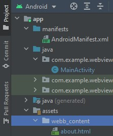
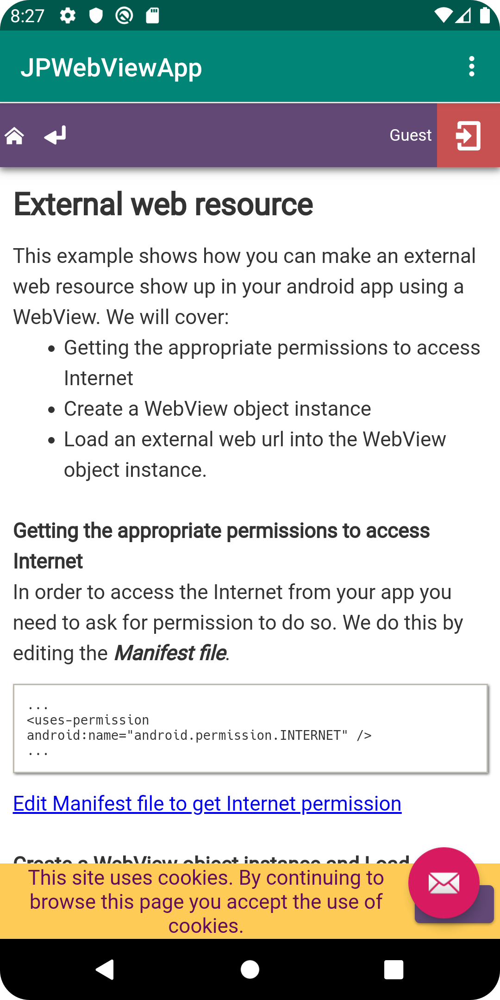
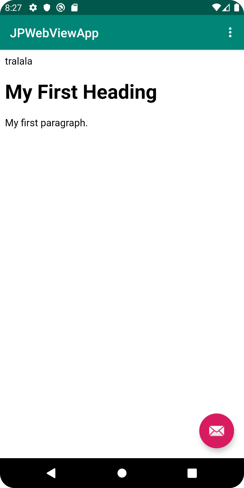

# Rapport

Det första som gjordes var att byta namn på applikationen, denna ändring gjordes vid `res/values/strings.xml` där värdet i variabeln ändrades enligt nedan.

```
<resources>
    <string name="WebViewApp">JPWebViewApp</string>              //här byts namnet från WebViewApp, till JPWebViewApp
    <string name="action_external_web">External Web Page</string>
    <string name="action_internal_web">Internal Web Page</string>
</resources>
```

För att ge applikationen internet access så har följande rad kod skrivits in i filen `AndroidManifest.xml` 

```
 <uses-permission android:name="android.permission.INTERNET" />
```
Ett id för webView elementet i filen `content_main.xml` angav 

```
  <WebView
       android:id="@+id/webview"
```

I filen `MainActivity.java` skapades en private member variable av `WebView` och instansierades i metoden `onCreate()`,
där den hittades med hjälp av `findViewById` via dess id som skapades innan.
```
public class MainActivity extends AppCompatActivity {
    private WebView myWebView;
}
```
```
 @Override
    protected void onCreate(Bundle savedInstanceState) {
        super.onCreate(savedInstanceState);
        setContentView(R.layout.activity_main);
        Toolbar toolbar = findViewById(R.id.toolbar);
        setSupportActionBar(toolbar);
        myWebView = (WebView) findViewById(R.id.webview);  /// här aktiverar vi elementet
}
```
fortsatt i `onCreate()` skriver vi in dessa rader kod, för att först associera webSettings med instansen av WebView
sedan aktiveras javascript genom att sätta värdet till __true__.

```
        WebSettings webSettings = myWebView.getSettings();
        webSettings.setJavaScriptEnabled(true);
```

För att utföra nästa steg (sätta till en html sida som asset) måste först en assets map skapas innehållande en map (som döps till webb_content) där vi sedan skapar html-filen. Denna fil fylls sedan med lite information så det finns något att se när sidan öppnas. 



För att kunna ladda upp url-länkar behöver man använda sig av `myWebView.loadUrl("lämplig url")`.

```
    myWebView.loadUrl("https://www.youtube.com/watch?v=d8zLGT5upZs&list=PLAxZA8hcpPLLjcktHtsZiACBvfAhUp6AF&index=25&ab_channel=LenaSYS");
    myWebView.loadUrl("file:///android_asset/webbcontent/about.html");
```

Vid testning av koden ovan erhölls ett resultat där innehållet i Webviewn hamnar under menyraden och en bit utanför fönstret,
Den uppdaterade WebView koden ser nu ut såhär, `android:layout_width=""` och `android:layout_height=""` har satts som `match_parent` medan `android:layout_marginTop=""` satts till 56dp.
Resterande inställningar gjordes via Designvyn där constraints vid applikationens parent fönster på alla kanter bortsett från toppen.
```
 <WebView
       android:id="@+id/webview"
       android:layout_width="match_parent"
       android:layout_height="match_parent"

       android:layout_marginTop="56dp"
       app:layout_constraintBottom_toBottomOf="parent"
       app:layout_constraintEnd_toEndOf="parent"
       app:layout_constraintHorizontal_bias="0.444"
       app:layout_constraintStart_toStartOf="parent" />
```
Skillnaden är att innehållet i Webview fönstret anpassas till det primära applikations fönstret, för att säkerställa att menyraden inte hamnar över WebView fönstret använde vi oss av layout_marginTop, där vi använde oss av menyradens höjd.

Efter det placerades url raderna med kod i deras respektive metod (metoderna fanns redan förskrivna, med tillhörande instruktioner).
```
   public void showExternalWebPage(){
        myWebView.loadUrl("https://www.youtube.com/watch?v=d8zLGT5upZs&list=PLAxZA8hcpPLLjcktHtsZiACBvfAhUp6AF&index=25&ab_channel=LenaSYS");
    }

    public void showInternalWebPage(){
        myWebView.loadUrl("file:///android_asset/webbcontent/about.html");
    }
```
För att möjliggöra öppnandet av de interna och externa url-länkarna vid en "tap" i menyn, sätts metodanropen i `onOptionsItemSelected(MenuItem item)` metoden. dessa placeras under lyssnaren för dess respektive menyalternativ. 
```
@Override
public boolean onOptionsItemSelected(MenuItem item) {

int id = item.getItemId();

        if (id == R.id.action_external_web) {
            showExternalWebPage();
            return true;
        }

        if (id == R.id.action_internal_web) {
           showInternalWebPage();
            return true;
        }

        return super.onOptionsItemSelected(item);
    }
```
External url 


Internal url
